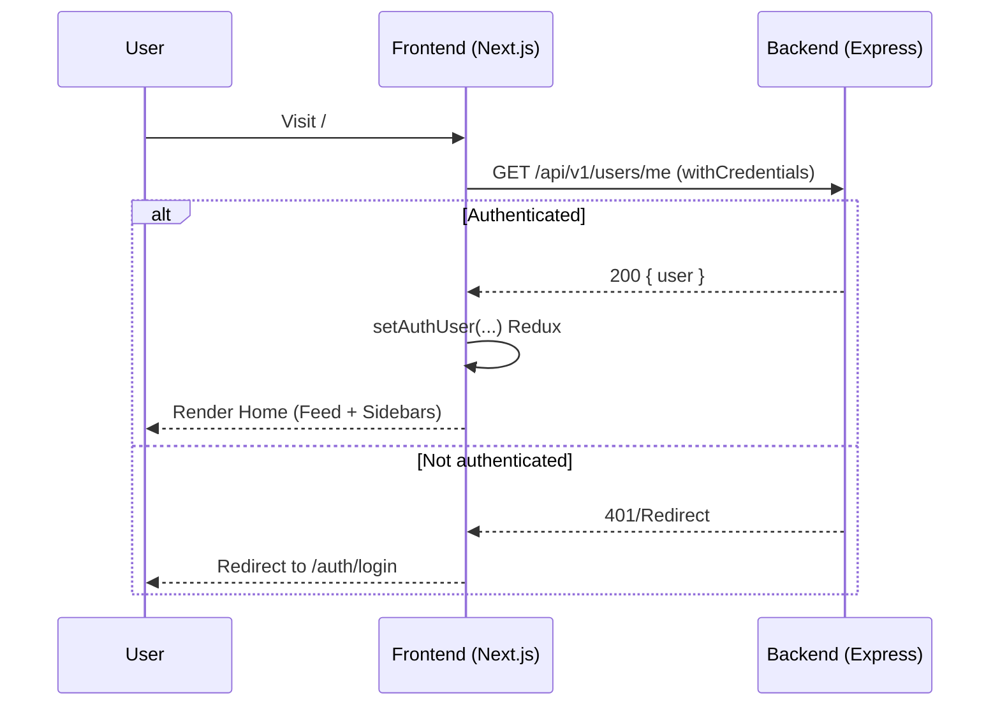
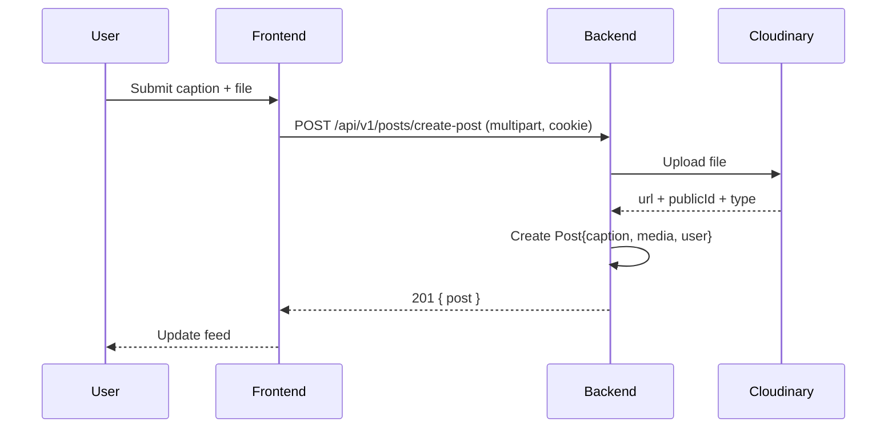

# ConnectSRMAP — One-Page Interview Readme

## What, Why, How (in simple terms)
- **What**: ConnectSRMAP is a student-only social app for SRMAP. Students can sign up, verify, log in, follow others, post images/videos, like/comment, save posts, edit profiles, get notifications, and search users.
- **Why**: To give SRMAP students a safe, verified space to connect, discover peers, and share updates with features they expect from a modern social platform.
- **How**: A Next.js frontend talks to an Express + MongoDB backend using cookie-based auth. Media is uploaded via Multer and stored in Cloudinary. The UI uses Tailwind + Radix. Emails are sent through Nodemailer for OTP verification and password reset.

## High-Level Architecture
- Frontend (`frontend/`): Next.js 15 App Router + React 19 + TypeScript
- Backend (`backend/`): Express + Mongoose (MongoDB)
- Media: Cloudinary (via `cloudinary` SDK)
- Email: Nodemailer + templates (`backend/emailTemplate/`)
- Auth: JWT in httpOnly cookies; verified via `GET /api/v1/users/me`

```mermaid
flowchart LR
  A[User Browser] -- Axios (withCredentials) --> B[Next.js Frontend (frontend/)]
  B -- HTTP (Cookies) --> C[Express API (backend/app.js)]
  C --> D[(MongoDB via Mongoose)]
  C --> E[Cloudinary (media)]
  C --> F[Nodemailer (email OTP)]
```

## Key Flows (diagrammed)

- Login (client-gated landing in `frontend/components/Home/home.tsx`)


- Create Post (with media)


## Backend API (mounted in `backend/app.js`)
- Base paths: `/api/v1/users`, `/api/v1/posts`
- Users (`backend/routes/userRoutes.js`)
  - POST `/signup`, `/login`, `/logout`, `/forget-password`, `/reset-password`
  - POST `/verify` (auth), `/resend-otp` (auth), `/change-password` (auth)
  - GET `/profile/:id`, `/me` (auth), `/suggested-user` (auth), `/notifications` (auth), `/search` (auth)
  - POST `/notifications/:notificationId/read` (auth), `/edit-profile` (auth, `multer.single("profilePicture")`)
- Posts (`backend/routes/postRoutes.js`)
  - POST `/create-post` (auth, `multer.single("media")`), `/save-unsave-post/:id` (auth), `/like-dislike/:id` (auth), `/comment/:id` (auth)
  - GET `/all`, `/user-post/:id`
  - DELETE `/delete-post/:id` (auth)

## Data Models (Mongoose)
- `User` (`backend/models/userModel.js`)
  - username, email, password (hashed), profilePicture, bio
  - followers[], following[], posts[], savedPosts[] (ObjectId refs)
  - isVerified, otp(+expires), resetPasswordOTP(+expires)
  - pre-save hash; `correctPassword` method
- `Post` (`backend/models/postModel.js`)
  - caption, media{url, publicId, type}, user, likes[], comments[]
  - index: `{ user: 1, createdAt: -1 }`
- `Comment` (`backend/models/commentModel.js`)
  - text, user
- `Notification` (`backend/models/notificationModel.js`)

## Frontend Highlights
- Auth gating in `frontend/components/Home/home.tsx` using `GET /users/me`, Redux Toolkit (`setAuthUser`), and redirects via `next/navigation`.
- Auth forms in `frontend/components/Auth/Login.tsx` and `Signup.tsx` using Axios + `handleAuthRequest`, Sonner toasts, and router navigation.
- UI/UX: TailwindCSS, Radix UI primitives, Framer Motion animations, Sonner toasts.

## Security & Middleware
- `helmet`, `express-mongo-sanitize`, `hpp`, `cors({ origin: ["http://localhost:3000"], credentials: true })`, `cookie-parser`, `morgan` (dev)
- JWT in httpOnly cookies; client uses `withCredentials: true` (see `Login.tsx`, `home.tsx`)

## Environment & Running Locally
- Frontend (`frontend/.env.local`): `NEXT_PUBLIC_BACKEND_API=http://localhost:<port>/api/v1`
- Backend (`backend/config.env`): `PORT`, `DB`, `JWT_*`, `CLOUDINARY_*`, SMTP creds
- Commands:
  - Frontend: `npm install && npm run dev` (in `frontend/`)
  - Backend: `npm install && npm start` (in `backend/`)

---

## Concise Q&A (tailored to this codebase)
- Q: What is ConnectSRMAP?
  - A: A student-only social app for SRMAP with verified accounts, posts (image/video), likes/comments, follow system, notifications, and search.
- Q: Why these technologies?
  - A: Next.js App Router for DX/SSR, Redux Toolkit for persistent auth state, Express + Mongoose for flexible APIs, Cloudinary for media, Nodemailer for OTP/password emails. Security middlewares protect inputs and headers.
- Q: How is authentication implemented?
  - A: JWT set in httpOnly cookies on login/signup. The client calls `GET /users/me` with `withCredentials: true` to validate sessions and gate routes. OTP verification sets `isVerified` on `User`.
- Q: Where is data stored?
  - A: MongoDB (Users, Posts, Comments, Notifications) via Mongoose. Media files are stored in Cloudinary; public URLs are saved in the `Post.media` field.
- Q: How do you upload media?
  - A: Multer parses multipart form data; backend uploads to Cloudinary and stores `{ url, publicId, type }` in `Post.media`.
- Q: What are key routes?
  - A: Users: signup/login/logout/verify/me/edit-profile/follow/notifications/search. Posts: create/all/user-post/save/like/comment/delete.
- Q: How is the home page protected?
  - A: `home.tsx` calls `/users/me`; if unauthenticated, it redirects to `/auth/login`. On success, it stores the user in Redux and renders the feed and sidebars.
- Q: How is security handled?
  - A: `helmet`, `express-mongo-sanitize`, `hpp`, CORS with `credentials`, cookie-based JWT, sanitized inputs, centralized error handling, and process-level guards in `server.js`.
- Q: How would you scale?
  - A: Add pagination/cursor-based queries for feeds, CDN for media (Cloudinary already helps), cache hot endpoints, use indexes, and consider WebSocket/Socket.IO for real-time notifications.
- Q: What improvements next?
  - A: Implement full real-time notifications/messages with Socket.IO, enrich search, add RSC/caching for feed, and extend test coverage for controllers.

## Interview Q&A (Question and Answer Format)

### Product / Product Design
- Q: What problem does ConnectSRMAP solve, and who is the primary user?
  - A: It gives SRMAP students a verified, campus-only social space to follow peers, share media, and discover others. Primary users are verified SRMAP students.
- Q: Which core features did you prioritize for MVP and why?
  - A: Signup/login with email OTP, edit profile, follow/unfollow, create post with media, like/comment, notifications, and search. These enable a complete creation–engagement–discovery loop.
- Q: Why follower-based feed over global or interest-based?
  - A: For a closed community, follower feeds reduce noise, improve relevance, and are simpler to moderate and scale initially.
- Q: How would you measure success on campus?
  - A: DAU/MAU, signup→verify conversion, weekly active posters/commenters, median session length, follower growth, and time-to-first-follow after signup.

### Frontend Implementation
- Q: Walk me through the auth gating in `frontend/components/Home/home.tsx`.
  - A: On mount, if Redux user is empty, call `GET ${BASE_API_URL}/users/me` (withCredentials). If 200, dispatch `setAuthUser` and render; else redirect to `/auth/login`. A spinner shows during the check.
- Q: Why Next.js App Router?
  - A: File-based routing, server/client component flexibility, built-in performance features, and a clean data-fetching model suited for modern React 19.
- Q: Why Redux Toolkit + redux-persist for auth state instead of Context/React Query?
  - A: Auth/session is client state shared app-wide; RTK gives predictable reducers and devtools, and persist survives reloads. React Query excels at server cache, not session state; Context scales poorly.
- Q: How do you handle API error messages and loading consistently?
  - A: Central `handleAuthRequest` wraps Axios calls to toggle loading and surface toasts (see `components/Auth/Login.tsx`, `Signup.tsx`).
- Q: How is mobile responsiveness handled for the three-column layout?
  - A: LeftSidebar hidden on small screens and opened via Radix `Sheet` with `MenuIcon`; RightSidebar hidden until large breakpoints; Feed flexes (see `components/Home/home.tsx`).
- Q: Where and why Framer Motion and Radix UI?
  - A: Radix components (Sheet/Dialog/Dropdown/Tabs) provide accessible primitives; Framer Motion for smooth transitions/animations in interactive areas.
- Q: How do you ensure sensitive tokens aren’t exposed client-side?
  - A: JWT is in an httpOnly cookie. Frontend uses only `NEXT_PUBLIC_*` envs like `NEXT_PUBLIC_BACKEND_API` (`frontend/server.ts`).

### Backend Implementation
- Q: Show the Express structure and responsibilities of `app.js` vs `server.js`.
  - A: `server.js` loads env, connects Mongo (`mongoose.connect`), starts server, and handles process-level errors. `app.js` builds the Express app: middleware (helmet, sanitize, hpp, cors, cookie-parser), routes (`/api/v1/users`, `/api/v1/posts`), static, and global error handler.
- Q: How is CORS configured and why is `credentials: true` necessary?
  - A: `cors({ origin: ["http://localhost:3000"], credentials: true })` so cookies are sent with cross-origin Axios requests; required for cookie-based auth.
- Q: Explain `isAuthenticated` and how it validates JWT from cookies.
  - A: It reads the JWT from the httpOnly cookie, verifies it, loads the user, ensures validity (e.g., verified), and attaches `req.user`; otherwise 401. Used on protected routes like `/users/me`, create post, follow, etc.
- Q: Where are global errors handled and what’s the response shape?
  - A: Unknown routes call `next(new AppError(...))`. `controllers/errorController.js` formats `{ status, statusCode, message }` (more detail in dev, minimal in prod).
- Q: How do you implement follow/unfollow safely?
  - A: Update both users’ arrays (`followers`/`following`) with idempotent operations and validations to prevent duplicates/inconsistency.

### Authentication / Security
- Q: Walk me through signup → email OTP → verify → login.
  - A: Signup creates user, hashes password, generates OTP+expiry, emails OTP. `/verify` (auth) validates OTP and sets `isVerified`. Login issues JWT in httpOnly cookie; client validates via `/users/me`.
- Q: Where is the JWT stored and implications of httpOnly cookie storage?
  - A: In an httpOnly cookie—prevents JS access (mitigates XSS token theft). Use `Secure` and `SameSite` flags and optionally CSRF tokens for state-changing requests.
- Q: How would you protect against CSRF with cookie auth?
  - A: SameSite cookies, CSRF tokens for mutations, and/or Origin/Referer checks server-side.
- Q: Why `express-mongo-sanitize`? Example attack?
  - A: Prevents injection using operators like `$gt`/`$ne`. E.g., `{ password: { $gt: "" } }` could bypass checks without sanitization.
- Q: How are rate-limits applied and where stricter?
  - A: Stricter on `/login`, `/signup`, `/forget-password`, `/reset-password`, `/verify`; moderate on posting/like/comment endpoints.

### Data Models and DB
- Q: Walk through the `User` schema and why.
  - A: Fields: `username`, `email`, `password` (hashed), `profilePicture`, `bio`; relations: `followers`, `following`, `posts`, `savedPosts`; verification and reset OTPs with expiries; pre-save hash; `correctPassword` method (see `backend/models/userModel.js`).
- Q: Why index `{ user: 1, createdAt: -1 }` on `Post`?
  - A: Optimizes timelines and recent-post queries with efficient sort and pagination by recency per user (see `backend/models/postModel.js`).
- Q: How do you model notifications—separate collection or embed?
  - A: Separate collection for scalable queries (by user, unread counts, mark-as-read) and to avoid bloating the `User` document.
- Q: How would you migrate to store more profile metadata?
  - A: Add fields with sane defaults, run a migration/backfill script, and make code tolerant to missing fields during rollout.

### File Uploads & Media
- Q: How are media uploaded and stored? What’s saved in Mongo?
  - A: `multer.single("media")` parses multipart; controller uploads to Cloudinary; Mongo stores `{ url, publicId, type }` in `Post.media` with caption/user.
- Q: How do you handle large files and restrict types/sizes?
  - A: Multer limits and server-side MIME validation; optionally `sharp` for image transformations and size control.
- Q: How do you delete media from Cloudinary when posts are deleted?
  - A: On `DELETE /posts/delete-post/:id`, use the saved `publicId` to call Cloudinary’s destroy API before/after removing the Mongo document.

### API Design
- Q: Why these endpoints under `/api/v1/users` and `/api/v1/posts`?
  - A: They mirror core user actions (signup/login/edit/follow/notify/search) and content actions (create/list/like/comment/save/delete), keeping concerns separated and predictable.
- Q: Which routes are public vs protected and why?
  - A: Public: `/posts/all`, viewing profiles. Protected: anything state-changing or user-specific (`/users/me`, create post, save/like/comment, edit-profile, notifications).
- Q: How would you version the API for future changes?
  - A: Maintain `/api/v1` and introduce `/api/v2` for breaking changes with a deprecation window.

### Real-time Features
- Q: How would you integrate Socket.IO for notifications?
  - A: Initialize on the server, authenticate socket connections, join user rooms, and emit events on follow/like/comment/mention actions.
- Q: What client changes to receive/display notifications?
  - A: Use `socket.io-client`, connect after login, subscribe to notification events, dispatch to Redux and show toasts/badges.
- Q: If notifications are high-volume, how do you scale delivery?
  - A: Use a Redis adapter for Socket.IO, horizontal scaling, queue-based fanout, rate-limit and batch notifications.

### Performance & Scaling
- Q: How to implement pagination/infinite scroll for `/posts/all`?
  - A: Cursor-based on `createdAt` (and `_id` tiebreaker). Return `nextCursor`; query `createdAt < cursor` for subsequent pages.
- Q: How to cache feed responses and invalidate after new posts?
  - A: Cache user feed keys in Redis; on new post, invalidate followers’ keys or use write-through to push updates.
- Q: How to scale media and CDN for production?
  - A: Lean on Cloudinary’s CDN, transformations, responsive breakpoints, lazy loading, and caching headers.

### Testing & Reliability
- Q: How would you unit test `authController` and `postController`?
  - A: Mock models, bcrypt, Cloudinary; assert validation, happy paths, and error branches with Jest. Use Supertest for route-level tests.
- Q: Which integration/e2e tests before shipping?
  - A: Flows: signup→verify→login, create post, like/comment, follow/unfollow, edit profile, notifications listing/mark-as-read.
- Q: How does the server handle `uncaughtException` and `unhandledRejection`?
  - A: Logged and gracefully shutdown in `backend/server.js` with `process.on(...)` handlers.

### DevOps / Deployment
- Q: What env vars are required and how do you manage secrets?
  - A: Backend: `PORT`, `DB`, `JWT_SECRET`, `JWT_EXPIRES_IN`, `CLOUDINARY_*`, SMTP creds. Frontend: `NEXT_PUBLIC_BACKEND_API`. Use a secret manager (e.g., platform secrets/Env vars store) in prod.
- Q: How to configure cookies and CORS for HTTPS + custom domain?
  - A: Set cookies `Secure` + `SameSite=None`, set exact `origin` to prod domain, keep `credentials: true`, and ensure TLS termination.
- Q: What CI/CD pipeline?
  - A: PR lint/tests, build artifacts, deploy backend (e.g., Render/Heroku/VM + Mongo Atlas) and frontend (e.g., Vercel/Netlify), with environment promotion and rollback.
- Q: How to configure logging and monitoring in prod?
  - A: Structured logs (Winston/Pino), centralized log aggregation, error tracking (Sentry), APM (New Relic/Datadog), healthchecks and uptime alerts.

### Trade-offs / Architecture Decisions
- Q: Why Redux Toolkit instead of React Query or hybrid?
  - A: RTK fits client/session/UI state and persistence best. A hybrid is viable later: React Query for server cache (feeds), RTK for auth/UI.
- Q: Would you move to microservices as the app grows?
  - A: Yes—separate notifications, media processing, and auth first; use an event bus and shared identity.
- Q: How to re-design notifications for very high volume?
  - A: Denormalize per-user inboxes, async fanout via queues, TTL/archival policies, and batched reads.

### UX / Product Follow-ups
- Q: How do you prevent spam accounts and verify users today?
  - A: Email OTP verification, rate limits on auth and content actions, potential campus-domain allowlist.
- Q: How would you implement content moderation and takedowns?
  - A: Reporting endpoints, admin tooling for review/takedown, audit logs, and file-type validation.
- Q: How would you surface discovery (search/suggested/hashtags)?
  - A: Current: `/users/search` and `/users/suggested-user`. Future: hashtag indexing, trending signals, and personalized ranking.
