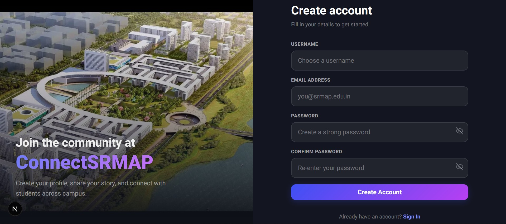
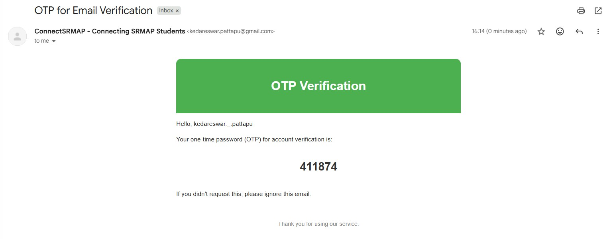
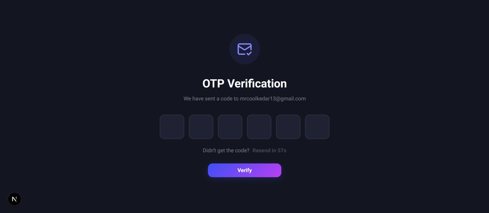
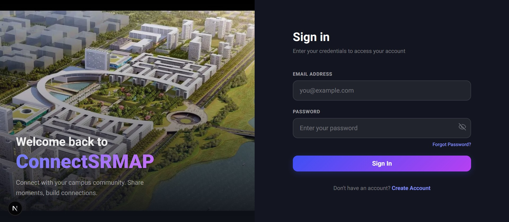
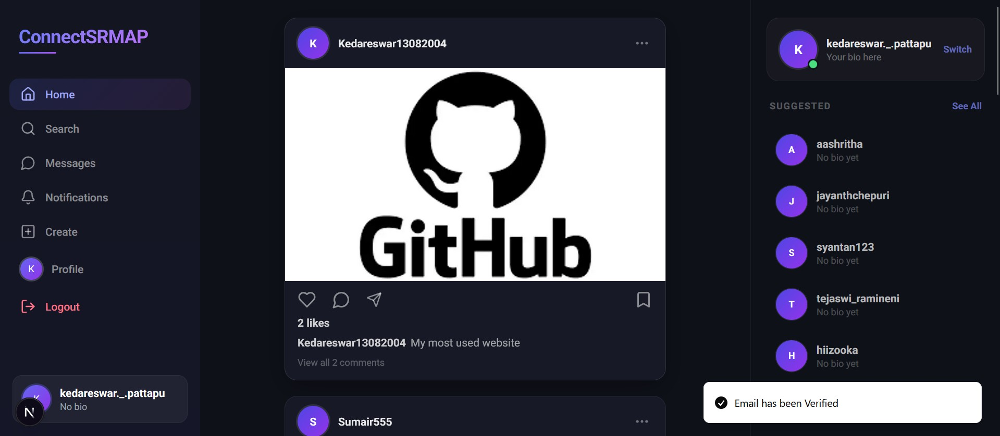
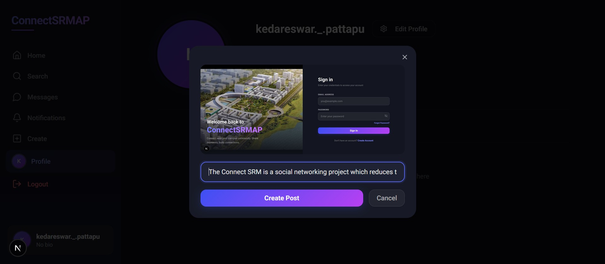
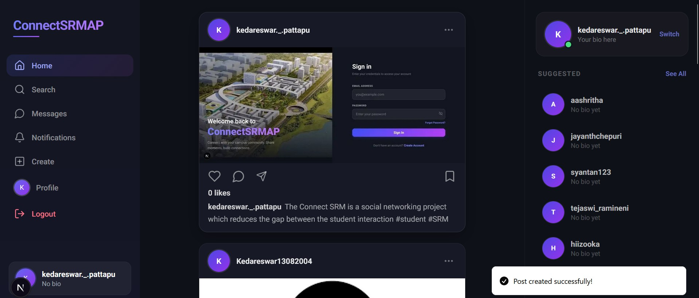
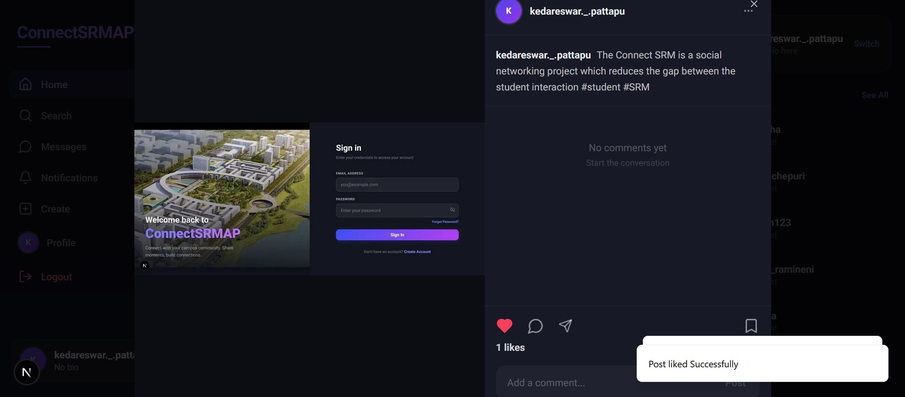
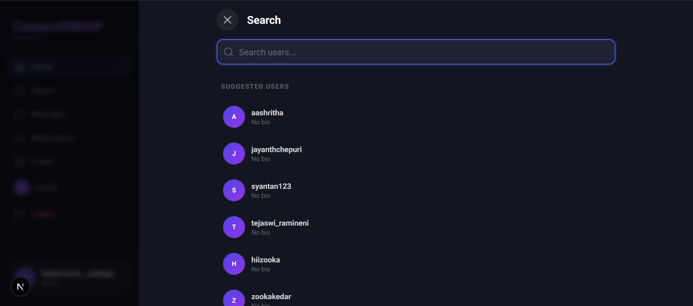
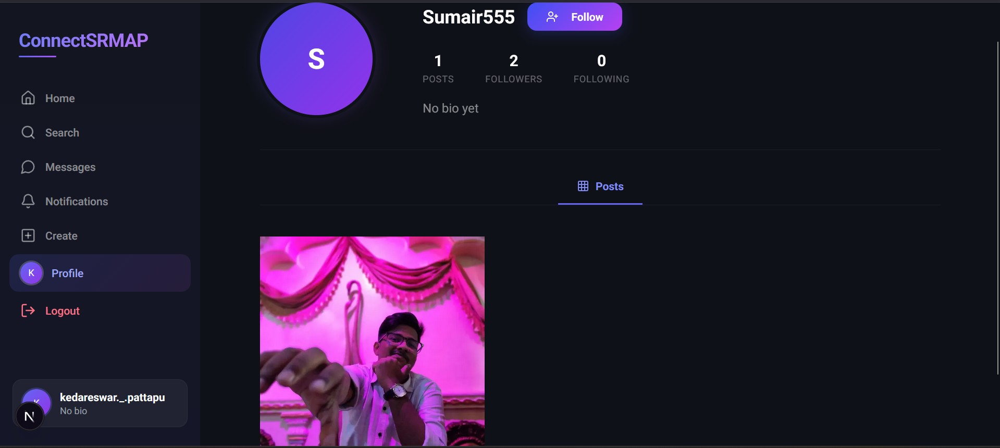

# 🌐 ConnectSRMAP

> A **premium social media platform** built exclusively for the SRM University AP campus community. Share moments, build connections, and stay connected — all in one beautiful dark-themed experience.

---

## 📑 Table of Contents

- [Tech Stack](#-tech-stack)
- [Getting Started](#-getting-started)
- [User Journey & Visual Flow](#-user-journey--visual-flow)
- [Project Architecture](#-project-architecture)
- [Frontend Structure](#-frontend-structure)
- [Backend Structure](#-backend-structure)
- [Route Flow Map](#-route-flow-map)
- [Database Models](#-database-models)
- [State Management](#-state-management)
- [Design System](#-design-system)
- [API Reference](#-api-reference)
- [Deployment](#-deployment)

---

## 🛠 Tech Stack

| Layer       | Technology                                                                    |
| ----------- | ----------------------------------------------------------------------------- |
| **Frontend**| Next.js 15 (App Router + Turbopack), React 19, TypeScript, Tailwind CSS       |
| **Backend** | Node.js, Express.js, Mongoose                                                 |
| **Database**| MongoDB Atlas                                                                 |
| **Auth**    | JWT (httpOnly cookies) + OTP email verification                               |
| **Media**   | Cloudinary (image/video upload via Multer)                                    |
| **State**   | Redux Toolkit + Redux Persist                                                 |
| **UI**      | shadcn/ui (Radix primitives) + Custom dark design system                      |
| **Realtime**| Socket.IO (notifications & messaging)                                         |
| **Hosting** | Vercel (frontend) + Render (backend)                                          |

---

## 🚀 Getting Started

### Prerequisites

- Node.js >= 18
- MongoDB Atlas cluster (connection string in `backend/config.env`)
- Cloudinary account (API keys in `backend/config.env`)

### 1. Clone the Repository

```bash
git clone https://github.com/Kedareswar13/ConnectSRMAP.git
cd ConnectSRMAP
```

### 2. Backend Setup

```bash
cd backend
npm install
```

Create/verify `backend/config.env` with:

```env
DATABASE=mongodb+srv://<user>:<password>@<cluster>.mongodb.net/<dbname>
PORT=8000
JWT_SECRET=<your_jwt_secret>
JWT_EXPIRES_IN=90d
JWT_COOKIE_EXPIRES_IN=90

CLOUDINARY_CLOUD_NAME=<your_cloud_name>
CLOUDINARY_API_KEY=<your_api_key>
CLOUDINARY_API_SECRET=<your_api_secret>

SMTP_HOST=smtp.gmail.com
SMTP_PORT=587
SMTP_USER=<your_email>
SMTP_PASS=<your_app_password>

NODE_ENV=development
```

Start the backend:

```bash
npm start
# Server runs on http://localhost:8000
```

### 3. Frontend Setup

```bash
cd frontend
npm install
```

Create/verify `frontend/.env.local` with:

```env
NEXT_PUBLIC_API_URL=http://localhost:8000/api/v1
```

Start the frontend:

```bash
npm run dev
# App runs on http://localhost:3000
```

---

## 📸 User Journey & Visual Flow

Take a look at the seamless experience ConnectSRMAP offers, from onboarding to social engagement.

### 1. Authentication & Onboarding
The journey begins with a secure and intuitive authentication flow.
- **Sign Up**: New users create an account with a beautifully designed dark-themed form.
  <br/>
  

- **Email Verification**: An OTP is sent to the user's registered email address for verification.
  <br/>
  

- **OTP Verification**: Users enter the OTP to confirm their identity and activate their account.
  <br/>
  

- **Login**: Returning users can log in securely to access their feed.
  <br/>
  

### 2. The Main Feed
Once authenticated, users land on the main feed, the heart of the platform.
- **Home Feed**: A rich, dynamic feed where users can scroll through posts, view media, and interact with the community.
  <br/>
  

### 3. Creating & Sharing Moments
Users can easily share their own moments with the community.
- **Post Creation**: A clean, modal-based interface allows users to upload images or videos and write captions.
  <br/>
  

- **Live Feed Update**: Instantly after creation, the new post seamlessly appears at the top of the feed.
  <br/>
  

### 4. Engagement & Interaction
ConnectSRMAP is built for connection, allowing rich interactions on every post.
- **Comments & Details**: Clicking on a post opens a detailed view where users can read and leave comments, creating engaging discussions.
  <br/>
  

### 5. Discoverability & Networking
Finding and connecting with other students is a breeze.
- **Search**: A responsive search feature helps users find friends and peers quickly.
  <br/>
  

- **User Profiles**: Visiting another user's profile showcases their posts, bio, and connection status, encouraging networking.
  <br/>
  

---

## 🏗 Project Architecture

```
ConnectSRMAP/
├── backend/                    # Express.js API server
│   ├── config.env              # Environment variables (DB, JWT, Cloudinary, SMTP)
│   ├── server.js               # Entry point — starts Express + Socket.IO + DB connection
│   ├── app.js                  # Express app config — middleware, CORS, routes
│   ├── controllers/            # Business logic handlers
│   │   ├── authController.js   # Signup, login, verify OTP, password reset
│   │   ├── userController.js   # Profile, follow/unfollow, search, suggestions
│   │   ├── postController.js   # CRUD posts, likes, comments, bookmarks
│   │   └── errorController.js  # Global error handler
│   ├── models/                 # Mongoose schemas
│   │   ├── userModel.js        # User schema (auth, profile, followers)
│   │   ├── postModel.js        # Post schema (media, likes, comments)
│   │   ├── commentModel.js     # Comment sub-schema
│   │   └── notificationModel.js# Notification schema (type, user, post refs)
│   ├── routes/                 # Express route definitions
│   │   ├── userRoutes.js       # /api/v1/users/* endpoints
│   │   └── postRoutes.js       # /api/v1/posts/* endpoints
│   ├── middlewares/            # Auth middleware (JWT verification)
│   └── utils/                  # Helpers (email sender, cloudinary config)
│
├── frontend/                   # Next.js 15 App
│   ├── app/                    # App Router pages
│   │   ├── layout.tsx          # Root layout (providers, fonts, Toaster)
│   │   ├── globals.css         # Design system (dark theme, animations, utilities)
│   │   ├── page.tsx            # Home route "/" → renders <Home />
│   │   ├── auth/               # Auth pages
│   │   │   ├── login/page.tsx  # Login route → <Login />
│   │   │   ├── signup/page.tsx # Signup route → <Signup />
│   │   │   ├── verify/page.tsx # OTP verification → <Verify />
│   │   │   ├── forget-password/page.tsx # Forgot password → <ForgetPassword />
│   │   │   └── reset-password/page.tsx  # Reset password → <PasswordReset />
│   │   ├── profile/[id]/page.tsx        # Dynamic profile → <Profile id={params.id} />
│   │   └── edit-profile/page.tsx        # Edit profile page
│   │
│   ├── components/             # All React components
│   │   ├── Auth/               # Authentication components
│   │   │   ├── Login.tsx       # Login form with dark sidebar background
│   │   │   ├── Signup.tsx      # Signup form matching login design
│   │   │   ├── PasswordInput.tsx # Reusable password field with toggle
│   │   │   ├── Verify.tsx      # OTP input grid with countdown timer
│   │   │   ├── ForgetPassword.tsx # Email input for password reset
│   │   │   └── ResetPassword.tsx  # OTP + new password form
│   │   │
│   │   ├── Home/               # Home page components
│   │   │   ├── home.tsx        # Main layout (sidebar + feed + right sidebar)
│   │   │   ├── LeftSidebar.tsx # Navigation, notifications, user card
│   │   │   ├── Feed.tsx        # Post feed with like/comment/save actions
│   │   │   ├── RightSidebar.tsx# Suggested users, current user card
│   │   │   └── CreatePostModel.tsx # Create post dialog (image/video upload)
│   │   │
│   │   ├── Profile/            # Profile page components
│   │   │   ├── Profile.tsx     # Full profile view (header + posts grid)
│   │   │   ├── Post.tsx        # Profile posts grid (own posts)
│   │   │   ├── Saved.tsx       # Saved posts grid wrapper
│   │   │   ├── SavedPosts.tsx  # Saved posts grid with hover overlays
│   │   │   ├── Posts.tsx       # Profile grid renderer
│   │   │   └── PostDialog.tsx  # Full post view dialog (media + comments)
│   │   │
│   │   ├── Helper/             # Shared utility components
│   │   │   ├── Comments.tsx    # Comment list with delete (dark themed)
│   │   │   ├── DotButton.tsx   # Post options menu (follow/delete/view)
│   │   │   ├── Notifications.tsx # Notification item renderer
│   │   │   ├── Search.tsx      # Full-screen search overlay
│   │   │   └── loadingButton.tsx # Button with loading spinner
│   │   │
│   │   ├── ui/                 # shadcn/ui primitives (Radix-based)
│   │   │   ├── dialog.tsx      # Dialog/Modal primitive
│   │   │   ├── button.tsx      # Button variants
│   │   │   ├── avatar.tsx      # Avatar with fallback
│   │   │   ├── sheet.tsx       # Side drawer (mobile nav)
│   │   │   └── ...             # Other Radix UI components
│   │   │
│   │   └── utils/              # Frontend utilities
│   │       └── apiRequest.ts   # Centralized API request handler with auth
│   │
│   ├── store/                  # Redux store
│   │   ├── store.ts            # Store config with persist
│   │   ├── authSlice.ts        # User auth state (login/logout)
│   │   ├── postSlice.ts        # Posts state (CRUD, likes, comments)
│   │   └── notificationSlice.ts# Notifications state
│   │
│   ├── types/                  # TypeScript interfaces
│   │   └── index.ts            # User, Post, Comment, Notification types
│   │
│   ├── utils/                  # Utility functions
│   │   └── formatTime.ts       # Timestamp formatting (e.g. "2 hours ago")
│   │
│   └── server.ts               # BASE_API_URL export
│
└── README.md                   # This file
```

---

## 🖼 Frontend Structure — Detailed

### App Router Pages (`frontend/app/`)

| Route                        | Page File                      | Component              | Purpose                                |
| ---------------------------- | ------------------------------ | ---------------------- | -------------------------------------- |
| `/`                          | `app/page.tsx`                 | `<Home />`             | Main feed with sidebar navigation      |
| `/auth/login`                | `app/auth/login/page.tsx`      | `<Login />`            | User authentication                    |
| `/auth/signup`               | `app/auth/signup/page.tsx`     | `<Signup />`           | New user registration                  |
| `/auth/verify`               | `app/auth/verify/page.tsx`     | `<Verify />`           | OTP email verification                 |
| `/auth/forget-password`      | `app/auth/forget-password/page.tsx` | `<ForgetPassword />` | Request password reset OTP            |
| `/auth/reset-password`       | `app/auth/reset-password/page.tsx`  | `<PasswordReset />`  | Enter OTP + new password               |
| `/profile/[id]`              | `app/profile/[id]/page.tsx`    | `<Profile id={id} />`  | View any user's profile                |
| `/edit-profile`              | `app/edit-profile/page.tsx`    | `<EditProfile />`      | Edit own profile (photo, bio, password)|

### Key Components

#### `Home/home.tsx` — Main Layout
- **Fixed sidebar** (left 64px) with `<LeftSidebar />`
- **Feed** (center) with `<Feed />`
- **Right sidebar** (suggested users) visible on `lg+`
- Mobile: hamburger menu with `<Sheet>` drawer

#### `Home/Feed.tsx` — Post Feed
- Fetches all posts via `GET /api/v1/posts/all`
- Filters out orphaned posts (null user)
- Each post: avatar, caption, media (image/video), like/comment/save buttons
- Like → `POST /api/v1/posts/like-dislike/:id`
- Save → `POST /api/v1/posts/save-unsave-post/:id`
- Comment → `POST /api/v1/posts/comment/:id`
- Clicking comment icon → opens `<PostDialog />`

#### `Home/LeftSidebar.tsx` — Navigation
- Routes: Home, Search, Messages, Notifications, Create, Profile, Logout
- Notification panel: bell icon with unread count badge + slide-down list
- Search: opens `<Search />` overlay
- Create: opens `<CreatePostModel />` dialog

#### `Profile/PostDialog.tsx` — Post Detail
- Split layout: media left (55%), comments right (45%)
- Inline comment input with "Post" button
- Like/save/share actions mirrored from Feed
- Delete option for own posts

---

## 🗄 Backend Structure — Detailed

### `server.js` — Entry Point
1. Loads `config.env` via `dotenv`
2. Connects to MongoDB via Mongoose
3. Creates HTTP server from `app.js`
4. Attaches Socket.IO for realtime events (notifications, messages)
5. Listens on `PORT` (default 8000)

### `app.js` — Express Configuration
- `cors()` with credentials + allowed origins
- `cookieParser()` for JWT tokens
- `express.json()` + `express.urlencoded()` for body parsing
- Route mounting: `/api/v1/users` → userRoutes, `/api/v1/posts` → postRoutes
- Global error handler via `errorController`

### Controllers

#### `authController.js`
| Function          | Purpose                                              |
| ----------------- | ---------------------------------------------------- |
| `signup`          | Register user + hash password + send OTP email       |
| `login`           | Validate credentials + issue JWT cookie              |
| `verify`          | Verify OTP code, mark user as verified               |
| `resendOtp`       | Generate and email a fresh OTP                       |
| `forgetPassword`  | Email a password-reset OTP                           |
| `resetPassword`   | Validate OTP + update password                       |
| `changePassword`  | Authenticated password change (current + new)        |
| `protect`         | Middleware: verify JWT from cookie, attach `req.user` |

#### `userController.js`
| Function            | Purpose                                              |
| ------------------- | ---------------------------------------------------- |
| `getMe`             | Return current authenticated user                    |
| `getProfile`        | Return any user by ID (populated posts)              |
| `editProfile`       | Update username, bio, profile picture (Cloudinary)    |
| `followUnfollow`    | Toggle follow/unfollow between users                 |
| `suggestedUsers`    | Return random users not yet followed                 |
| `searchUsers`       | Search users by username query                       |
| `deleteAccount`     | Delete user + their posts + cleanup references       |

#### `postController.js`
| Function          | Purpose                                              |
| ----------------- | ---------------------------------------------------- |
| `createPost`      | Upload media to Cloudinary + create post document    |
| `getAllPosts`      | Return all posts (populated user + comments.user)    |
| `likeDislike`     | Toggle user ID in post.likes array                   |
| `addComment`      | Push new comment to post.comments                    |
| `deleteComment`   | Remove comment from post by comment ID               |
| `saveUnsave`      | Toggle post ID in user.savedPosts                    |
| `deletePost`      | Delete post + media from Cloudinary                  |

---

## 🗺 Route Flow Map

### Authentication Flow
```
/auth/signup → POST /users/signup → JWT cookie set → /auth/verify
/auth/verify → POST /users/verify → verified=true → / (home)
/auth/login  → POST /users/login  → JWT cookie set → / (home)
/ (home)     → GET /users/me      → auth check → show feed OR → /auth/login
```

### Password Reset Flow
```
/auth/forget-password → POST /users/forget-password → email OTP
/auth/reset-password?email=... → POST /users/reset-password → password updated
```

### Main App Flow
```
/ (Home)           → Feed renders → GET /posts/all
                   → Each post: like, comment, save, view dialog
/profile/[id]      → GET /users/profile/:id → posts grid
/edit-profile      → POST /users/edit-profile → update profile
                   → POST /users/change-password → update password
```

---

## 📊 Database Models

### User (`userModel.js`)
```javascript
{
  username:       String (unique, required),
  email:          String (unique, required),
  password:       String (hashed with bcrypt),
  profilePicture: String (Cloudinary URL),
  bio:            String (default ""),
  isVerified:     Boolean (default false),
  otp:            String,
  otpExpires:     Date,
  posts:          [ObjectId → Post],
  savedPosts:     [ObjectId → Post],
  followers:      [ObjectId → User],
  following:      [ObjectId → User],
  createdAt:      Date
}
```

### Post (`postModel.js`)
```javascript
{
  user:     ObjectId → User (required),
  caption:  String,
  media:    { url: String, type: "image" | "video", publicId: String },
  likes:    [ObjectId → User],
  comments: [ObjectId → Comment],
  createdAt: Date
}
```

### Comment (`commentModel.js`)
```javascript
{
  user:      ObjectId → User,
  text:      String (required),
  createdAt: Date
}
```

### Notification (`notificationModel.js`)
```javascript
{
  type:       String ("like", "comment", "follow"),
  sender:     ObjectId → User,
  receiver:   ObjectId → User,
  postId:     ObjectId → Post (optional),
  message:    String,
  read:       Boolean (default false),
  createdAt:  Date
}
```

---

## 🧠 State Management

### Redux Store (`store/store.ts`)

| Slice             | State Shape                                | Persisted? |
| ----------------- | ------------------------------------------ | ---------- |
| `auth`            | `{ user: User \| null }`                   | ✅ Yes     |
| `posts`           | `{ posts: Post[] }`                        | ❌ No      |
| `notifications`   | `{ notifications: Notification[] }`        | ❌ No      |

### Key Actions

- **`setAuthUser(user)`** — Set logged-in user (persisted to localStorage)
- **`signOut()`** — Clear user + localStorage
- **`setPost(posts)`** — Replace all posts
- **`addPost(post)`** — Prepend new post
- **`likeOrDislike({postId, userId})`** — Toggle like in post.likes
- **`addComment({postId, comment})`** — Push comment to post
- **`deleteComment({postId, commentId})`** — Remove comment
- **`deletePost(postId)`** — Remove post from state

---

## 🎨 Design System

### Dark Theme Palette

| Token            | Value                    | Usage                        |
| ---------------- | ------------------------ | ---------------------------- |
| `--bg-base`      | `hsl(230, 25%, 8%)`     | Page background              |
| `--bg-surface`   | `hsl(230, 25%, 12%)`    | Card backgrounds             |
| `--bg-elevated`  | `hsl(230, 25%, 16%)`    | Input backgrounds            |
| `--bg-sidebar`   | `hsl(230, 25%, 10%)`    | Sidebar + auth form panels   |
| Accent gradient  | Indigo → Purple          | Buttons, brand text, links   |
| Text primary     | `white/95%`              | Headings, usernames          |
| Text secondary   | `white/60%`              | Labels, body text            |
| Text muted       | `white/30%`              | Placeholders, timestamps     |
| Borders          | `white/6%`               | Dividers, card borders       |

### Utility Classes

- `.dark-card` — Surface card with hover shadow
- `.btn-gradient` — Indigo→Purple gradient button
- `.input-dark` — Dark input with focus ring
- `.input-auth` — Translucent input for auth pages
- `.gradient-text` — Indigo→Purple text gradient
- `.glass-dark` — Glassmorphism backdrop
- `.sidebar-item` — Nav item with hover/active states
- `.post-card` — Staggered fade-in animation
- `.animate-like-pop` — Heart bounce animation
- `.animate-fade-in-up` — Entry animation

---

## 🔌 API Reference

### Auth Endpoints (`/api/v1/users`)

| Method | Endpoint              | Auth | Body                                              |
| ------ | --------------------- | ---- | ------------------------------------------------- |
| POST   | `/signup`             | ❌    | `{username, email, password, passwordConfirm}`    |
| POST   | `/login`              | ❌    | `{email, password}`                               |
| POST   | `/verify`             | ✅    | `{otp}`                                           |
| POST   | `/resend-otp`         | ✅    | —                                                 |
| POST   | `/forget-password`    | ❌    | `{email}`                                         |
| POST   | `/reset-password`     | ❌    | `{email, otp, password, passwordConfirm}`         |
| POST   | `/change-password`    | ✅    | `{currentPassword, newPassword, newPasswordConfirm}` |
| GET    | `/me`                 | ✅    | —                                                 |
| GET    | `/logout`             | ✅    | —                                                 |

### User Endpoints (`/api/v1/users`)

| Method | Endpoint                 | Auth | Purpose                    |
| ------ | ------------------------ | ---- | -------------------------- |
| GET    | `/profile/:id`           | ✅    | Get user profile           |
| POST   | `/edit-profile`          | ✅    | Update profile (multipart) |
| POST   | `/follow-unfollow/:id`   | ✅    | Toggle follow              |
| GET    | `/suggested-user`        | ✅    | Get suggested users        |
| GET    | `/search?query=...`      | ✅    | Search users               |
| DELETE | `/delete-account`        | ✅    | Delete own account         |

### Post Endpoints (`/api/v1/posts`)

| Method | Endpoint                      | Auth | Purpose                    |
| ------ | ----------------------------- | ---- | -------------------------- |
| POST   | `/create-post`                | ✅    | Create post (multipart)    |
| GET    | `/all`                        | ❌    | Get all posts              |
| POST   | `/like-dislike/:id`           | ✅    | Toggle like                |
| POST   | `/comment/:id`                | ✅    | Add comment                |
| DELETE | `/comment/:postId/:commentId` | ✅    | Delete comment             |
| POST   | `/save-unsave-post/:id`       | ✅    | Toggle bookmark            |
| DELETE | `/delete-post/:id`            | ✅    | Delete post                |

---

## 🚢 Deployment

### Frontend (Vercel)
1. Push to GitHub
2. Connect repo to Vercel
3. Set environment variable: `NEXT_PUBLIC_API_URL=https://your-backend.onrender.com/api/v1`
4. Deploy

### Backend (Render)
1. Create Web Service on Render
2. Set build command: `npm install`
3. Set start command: `npm start`
4. Add all `config.env` variables as environment variables
5. Deploy

### Important CORS Config
In `app.js`, update the `origin` array with your Vercel domain:
```javascript
cors({
  origin: ["http://localhost:3000", "https://your-app.vercel.app"],
  credentials: true,
})
```

---

## 📝 Known Issues & Next Steps

- **LCP Warning**: Add `priority` prop to the first feed image for performance
- **Comment Delete Route**: Ensure `DELETE /posts/comment/:postId/:commentId` exists in `postRoutes.js`
- **@next/swc Mismatch**: Run `npm install next@latest` to align versions
- **Socket.IO**: Full realtime notification delivery is set up but requires frontend Socket provider integration

---

## 👤 Author

**Kedareswar** — [GitHub](https://github.com/Kedareswar13)

---

<p align="center">Built with ❤️ for the SRM University AP community</p>
