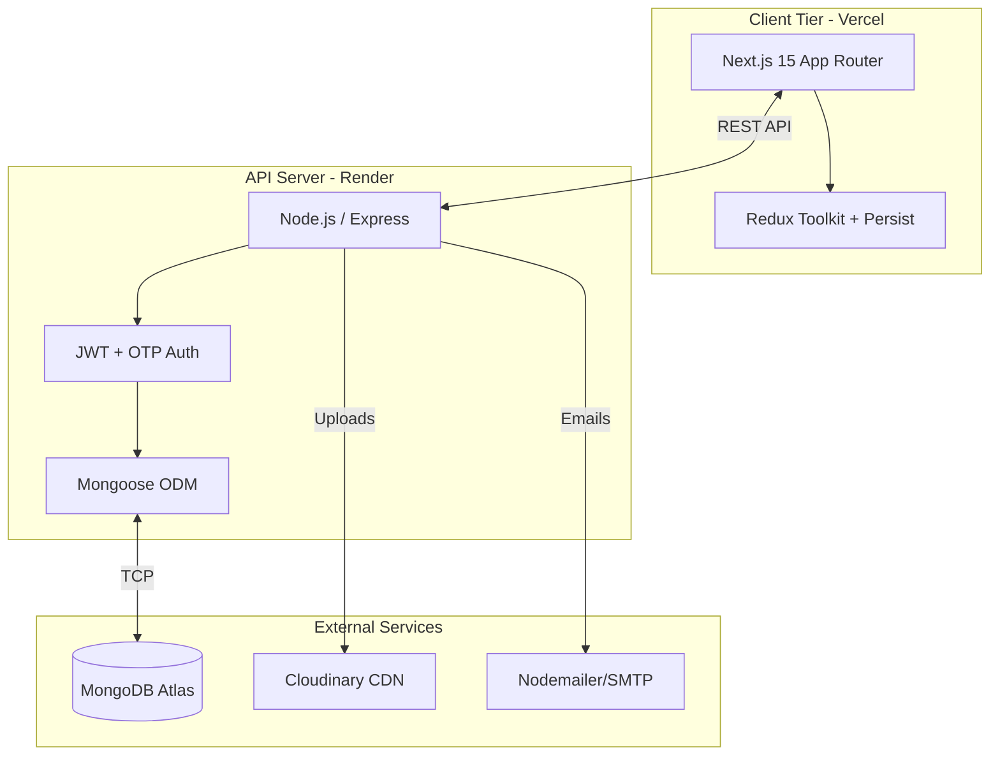

<div align="center">

# 🌐 ConnectSRMAP
### Premium Social Media Platform for SRM University AP

[](https://connect-srmap.vercel.app/)
[](LICENSE)

*A premium social media platform built exclusively for the SRM University AP campus community. Share moments, build connections, and stay connected — all in one beautiful dark-themed experience.*

</div>

---

## 📖 Table of Contents
1. [What is ConnectSRMAP?](#-what-is-connectsrmap)
2. [Architecture & Workflow](#-architecture--workflow)
3. [Tabulated Tech Stack](#-tabulated-tech-stack)
4. [User Journey & Visual Flow](#-user-journey--visual-flow)
5. [Database Models & State Management](#-database-models--state-management)
6. [Local Setup Instructions](#-local-setup-instructions)
7. [Project Structure](#-project-structure)
8. [API Endpoints](#-api-endpoints)

---

## 🎯 What is ConnectSRMAP?

ConnectSRMAP is a beautifully crafted social network tailored specifically for the **SRM University AP** community. It provides a secure, exclusive, and highly engaging environment for students to interact, share updates, and discover peers on campus.

### 🚨 The Problem
University communities often lack a centralized, distraction-free platform for students to connect:
1. **Scattered Communication:** Important student life updates and connections happen across fragmented groups on generic platforms.
2. **Lack of Exclusivity:** Public social networks don't provide a curated safe space restricted to the campus community.
3. **Cluttered UI:** Most existing university portals or forums are outdated, unengaging, and lack modern social networking features.

### 💡 The ConnectSRMAP Solution
ConnectSRMAP bridges this gap by offering a fully-fledged, premium social networking experience:
- **Exclusive Access:** Features robust OTP-based email verification, ensuring only legitimate users can join.
- **Rich Media Sharing:** Seamless integration with Cloudinary allows users to post images and videos to share their campus life.
- **Real-Time Engagement:** Users can like, save, and comment on posts, fostering active community discussions.
- **Modern Dark-Themed UI:** A stunning, fully responsive dark-themed interface built with Next.js and Tailwind CSS, delivering a flagship-level user experience.

### ✨ Key Features
1. **🔐 Secure Authentication:** JWT-based login with OTP email verification.
2. **📱 Dynamic Feed:** A fluid, infinite-scroll-like experience for viewing campus posts.
3. **📸 Media Uploads:** Robust image and video handling.
4. **💬 Interactive Comments:** Nested discussions and real-time like/bookmark actions.
5. **🔍 Discoverability:** Search for peers and get suggested users to follow.
6. **🎨 Premium Aesthetics:** Glassmorphism, smooth animations, and a curated dark color palette.

---

## 🏗️ Architecture & Workflow

ConnectSRMAP employs a decoupled Client-Server architecture, ensuring high performance, scalability, and security.


```mermaid
graph TD
    %% Frontend
    subgraph Frontend [Client Tier - Vercel]
        UI[Next.js 15 App Router]
        Redux[Redux Toolkit + Persist]
        UI --> Redux
    end

    %% Backend API
    subgraph Backend [API Server - Render]
        Express[Node.js / Express]
        Auth[JWT + OTP Auth]
        Mongoose[Mongoose ODM]
        Express --> Auth
        Auth --> Mongoose
    end

    %% External Services
    subgraph External [External Services]
        DB[(MongoDB Atlas)]
        Cloudinary[Cloudinary CDN]
        SMTP[Nodemailer/SMTP]
    end

    %% Connections
    UI <-->|REST API| Express
    Mongoose <-->|TCP| DB
    Express -->|Uploads| Cloudinary
    Express -->|Emails| SMTP
```

---

## 💻 Tabulated Tech Stack

| Tier | Technology | Purpose |
|------|------------|---------|
| **Frontend** | Next.js 15 + React 19 | Server-side rendering and lightning-fast client delivery. |
| **Styling & UI** | Tailwind CSS + shadcn/ui | Premium dark-themed UI components and fluid animations. |
| **State** | Redux Toolkit + Persist | Centralized global state management across sessions. |
| **API Server**| Node.js + Express | Handles user auth, routing, and database communication. |
| **Database** | MongoDB Atlas + Mongoose | Flexible NoSQL data persistence and schema management. |
| **Media CDN** | Cloudinary | High-performance image and video storage/delivery. |
| **Realtime** | Socket.IO | Real-time notifications and active messaging. |
| **Hosting** | Vercel & Render | Automated CI/CD deployments for frontend and backend. |

---

## 📸 User Journey & Visual Flow

Take a look at the seamless experience ConnectSRMAP offers, from onboarding to social engagement.

### 1. Authentication & Onboarding
The journey begins with a secure and intuitive authentication flow.
- **Sign Up**: New users create an account with a beautifully designed dark-themed form.
  <br/>
  

- **Email Verification**: An OTP is sent to the user's registered email address for verification.
  <br/>
  

- **OTP Verification**: Users enter the OTP to confirm their identity and activate their account.
  <br/>
  

- **Login**: Returning users can log in securely to access their feed.
  <br/>
  

### 2. The Main Feed
Once authenticated, users land on the main feed, the heart of the platform.
- **Home Feed**: A rich, dynamic feed where users can scroll through posts, view media, and interact with the community.
  <br/>
  

### 3. Creating & Sharing Moments
Users can easily share their own moments with the community.
- **Post Creation**: A clean, modal-based interface allows users to upload images or videos and write captions.
  <br/>
  

- **Live Feed Update**: Instantly after creation, the new post seamlessly appears at the top of the feed.
  <br/>
  

### 4. Engagement & Interaction
ConnectSRMAP is built for connection, allowing rich interactions on every post.
- **Comments & Details**: Clicking on a post opens a detailed view where users can read and leave comments, creating engaging discussions.
  <br/>
  

### 5. Discoverability & Networking
Finding and connecting with other students is a breeze.
- **Search**: A responsive search feature helps users find friends and peers quickly.
  <br/>
  

- **User Profiles**: Visiting another user's profile showcases their posts, bio, and connection status, encouraging networking.
  <br/>
  

---

## 🧠 Database Models & State Management

### MongoDB Schemas

**1. User (`userModel.js`)**
```javascript
{
  username: String, email: String, password: String(hashed),
  profilePicture: String(Cloudinary URL), bio: String,
  isVerified: Boolean, otp: String, otpExpires: Date,
  posts: [ObjectId], savedPosts: [ObjectId],
  followers: [ObjectId], following: [ObjectId]
}
```

**2. Post (`postModel.js`)**
```javascript
{
  user: ObjectId, caption: String,
  media: { url: String, type: "image" | "video", publicId: String },
  likes: [ObjectId], comments: [ObjectId]
}
```

**3. Notification & Comment**
- Notifications track `type` ("like", "comment", "follow"), `sender`, and `receiver`.
- Comments contain the `user`, `text`, and timestamps.

### Redux State (`store.ts`)
| Slice | State Shape | Persisted? |
|-------|-------------|------------|
| `auth` | `{ user: User \| null }` | ✅ Yes (localStorage) |
| `posts` | `{ posts: Post[] }` | ❌ No |
| `notifications` | `{ notifications: Notification[] }` | ❌ No |

---

## 🚀 Local Setup Instructions

You can easily run the application locally by setting up the Backend API and the Next.js Client.

### Prerequisites
- Node.js >= 18
- MongoDB Atlas cluster
- Cloudinary account credentials

### 1. Backend Setup
```bash
git clone https://github.com/Kedareswar13/ConnectSRMAP.git
cd ConnectSRMAP/backend
npm install
```
Create `backend/config.env` with your DB, JWT, Cloudinary, and SMTP secrets.
```bash
npm run dev
# Server runs on http://localhost:8000
```

### 2. Frontend Setup
Open a new terminal:
```bash
cd ConnectSRMAP/frontend
npm install
```
Create `frontend/.env.local`:
```env
NEXT_PUBLIC_API_URL=http://localhost:8000/api/v1
```
```bash
npm run dev
# App runs on http://localhost:3000
```

---

## 📂 Project Structure

```text
ConnectSRMAP/
├── backend/                    # Express.js API Gateway
│   ├── config.env              # Environment Variables
│   ├── controllers/            # Auth, User, and Post Logic
│   ├── models/                 # Mongoose Schemas
│   ├── routes/                 # API Endpoints
│   ├── middlewares/            # JWT Verification
│   └── server.js               # Express Entry Point
├── frontend/                   # Next.js UI Client
│   ├── app/                    # App Router (Pages & Layout)
│   ├── components/             # Reusable UI Widgets (Home, Profile, Auth)
│   ├── store/                  # Redux Toolkit Config
│   ├── types/                  # TypeScript Interfaces
│   └── utils/                  # API Call Handlers
└── assets/                     # Demo Screenshots
```

---

## 🔌 API Endpoints

### Auth Gateway (`/api/v1/users`)
| Method | Endpoint | Description |
|--------|----------|-------------|
| `POST` | `/signup` | Register user and send OTP |
| `POST` | `/login` | Authenticate and issue httpOnly JWT |
| `POST` | `/verify` | Verify OTP to activate account |
| `POST` | `/forget-password`| Send password reset OTP |
| `POST` | `/change-password`| Authenticated password change |
| `GET`  | `/me` | Fetch active user session |

### Social Gateway (`/api/v1/posts` & `/users`)
| Method | Endpoint | Description |
|--------|----------|-------------|
| `GET`  | `/posts/all` | Fetch global chronological feed |
| `POST` | `/posts/create-post`| Upload media & create post |
| `POST` | `/posts/like-dislike/:id`| Toggle like on post |
| `POST` | `/posts/comment/:id` | Add nested comment |
| `GET`  | `/users/profile/:id`| Fetch user details & posts |
| `GET`  | `/users/search` | Search users by username |

---

## 👨‍💻 Built By
**Pattapu Kedareswar**
- GitHub: [@Kedareswar13](https://github.com/Kedareswar13)
- LinkedIn: [Kedareswar Pattapu](https://www.linkedin.com/in/kedareswar-pattapu-0355bb254/)

<p align="center">Built with ❤️ for the SRM University AP community</p>
